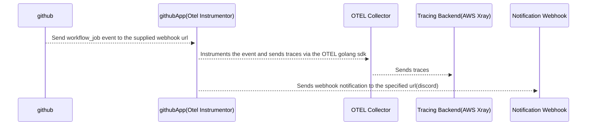

# gh-actions-otel-instrumentor


This project aims to provide a full github actions open telemetry tracing with notifications without copy-pasting [workflows](https://docs.github.com/en/webhooks-and-events/webhooks/webhook-events-and-payloads?actionType=completed#workflow_job)

```bash
.
├── Taskfile.yml                <-- Task Runner
├── src                         <-- Source code for the lambda function
└── template.yaml               <-- SAM template
```

## How does this works



## Requirements

* Propertly configured AWS credentials
* [Docker installed](https://www.docker.com/community-edition)
* [Golang](https://golang.org)
* [SAM CLI](https://docs.aws.amazon.com/serverless-application-model/latest/developerguide/serverless-sam-cli-install.html)
* [Go Task](https://github.com/go-task/task)

## Setup process

### Local development

**Invoking function locally through local invoke**

```bash
task sam:local
```

If the previous command ran successfully you should see traces in AWS-xray which show the flow of steps in a github workflow job.

## Packaging and deployment
* To package the application run `task go:build`, this will create a `bin` directory with the binary
* To deploy the lamda function use `task tf:apply` and input the discord webhook URL for notifications

### Testing

We use `testing` package that is built-in in Golang and you can simply run the following command to run our tests: `task go:test`, for coverage html report run `task go:cover`

# Appendix

### Golang installation

Please ensure Go 1.20 (where 'x' is the latest version) is installed as per the instructions on the official golang website: https://golang.org/doc/install

## Setup Github App
1. Go to your github account > Settings > Developer settings > Github Apps > New Github App
2. Fill the details:
    - *GitHub App name* With your preferred name
    - *Homepage URL* Put the lambda url based on the outputs of the terraform apply (i.e. `terraform output -json | jq -j '.url.value'`)
    - *Webhook* Mark the Active checkbox and fill the Webhook URL input with the same lambda url as before 
    - *Fill the Webhook Secret* with the value of `terraform output -json | jq -j '.webhook_secret.value'`
    - *Check enable SSL verification*
    - *Create the app*
